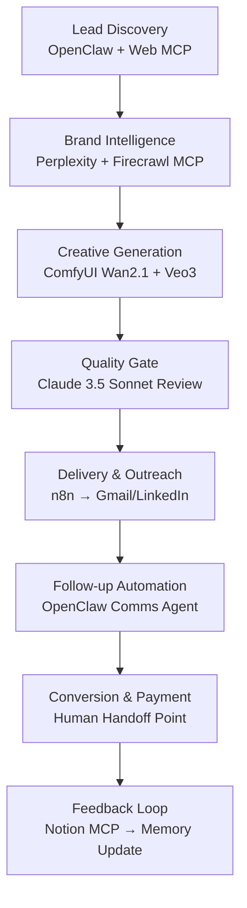

# 🚀 AI Superpowers: Best Workflows & Possibilities — March 2026
*Research synthesized from BRANDFUSION project files + live research*

---

## 🔍 Project Context (What We Found in Your Folder)

Your **BRANDFUSION** project already has strong foundations:

| Existing Research File | What It Covers |
|---|---|
| `tech_intelligence_2026/emerging_tech_report.md` | Full landscape of 2026 breakthroughs — AI, Robots, Quantum, Fusion, BCI |
| `openclaw_research/mcp_tool_delegation.md` | SLICE multi-agent architecture, MCP tool assignments |
| `openclaw_research/business_and_crypto_cases.md` | Crypto automation, "Stealth Ad Agency" pipeline w/ OpenClaw |
| `openclaw_research/security_architectures.md` | Sandboxing, blast-radius isolation |
| `content/viral_niches_and_prompts.md` | Content strategy & viral prompts |
| `agents/` | Brand strategist, content strategy, creative director agents |

> [!NOTE]
> Your project is **well ahead** of most people. You already have an AI agency pipeline, multi-agent research, and tech intelligence infrastructure. This report focuses on synthesizing gaps and identifying the **highest-leverage next moves**.

---

## ⚡ The 9 Core AI Superpowers Available NOW (March 2026)

### 1. 🧠 Autonomous Computer Use (The Biggest One)
- **GPT-5.4 Pro achieved 75% success rate** on real desktop tasks — surpassing the human baseline of 72.4%
- This means AI can literally operate your computer: browse, file, click, fill forms
- **Your leverage**: OpenClaw/Anthropic agents can run the entire BrandFusion pipeline (scrape leads → render ComfyUI video → email pitch) with **zero manual input**

### 2. 🔀 Multi-Agent Orchestration (SLICE Framework)
The 2026 gold standard — already documented in your `mcp_tool_delegation.md`:

```
Orchestrator (no real-world tools)
    ├── Researcher Agent    → [Web MCP, Perplexity]
    ├── Crypto Agent        → [Binance MCP, Wallet]
    ├── Comms Agent         → [Gmail MCP, Slack]
    └── Creative Agent      → [ComfyUI API, n8n Webhook]
```

**Key insight**: 40% of enterprise apps will embed specialized AI agents by end of 2026 (Gartner). You're already ahead by building this architecture.

### 3. 🎨 Generative AI Content Factories (ComfyUI + Wan2.1)
- **ComfyUI App Builder**: Turn any workflow node-graph into a shareable URL-based app
- **ComfyHub**: Distribute your BrandFusion video pipeline to clients without them touching the node graph
- Your `text_to_video_wan22_14B.json` workflow is already primed for this
- **Superpower**: One person can run a video ad agency serving 100+ clients with AI rendering

### 4. 🔧 n8n as the Central Nervous System
n8n is uniquely positioned as the **glue** connecting all agents:
- Connects 400+ apps (Gmail, Notion, Shopify, LinkedIn, ComfyUI)
- Costs 70-90% less than Zapier for complex workflows
- Self-hosted = complete data privacy
- **In BrandFusion context**: n8n is the trigger layer between lead scraping, ComfyUI rendering, and email delivery

### 5. 🤖 Local LLMs — Frontier Quality at Near-Zero Cost
- **Falcon-H1R 7B** matches models 7x its size — runs on consumer GPU
- **DeepSeek V4**: 1T-param open source, 1M context, nearly free via OpenRouter
- **NVIDIA Vera Rubin**: 10x reduction in inference costs coming in 12 months
- **Your action**: Route testing/bulk tasks through DeepSeek V3.2 (cheapest), reserve Claude 3.5/GPT-5 for client-facing final outputs

### 6. 🔒 Secure MCP Sandboxing
- 5,800+ official MCP servers available as of early 2026
- Red Hat OpenShift + Oracle Fusion added **native MCP support** — enterprise databases now accessible to agents
- Tool Retrieval: Instead of loading 50 tools, OpenClaw pre-filters and only loads the 3 relevant to your current task
- This eliminates "Tool Sprawl" — the #1 agent failure mode in 2025

### 7. 📊 Real-Time Intelligence (Research Agent Superpower)
Agentic research loops that run 24/7:
- Monitor Twitter Alpha accounts → detect new token sentiment → execute micro-trades
- Monitor competitor ad creatives → auto-generate superior alternatives
- Scrape Shopify stores in niche → qualify leads → trigger BrandFusion pitch pipeline

### 8. 🧬 AI-Powered Second Brain
Personal productivity compound interest:
- Auto-categorize all receipts, voice memos, PDFs → Notion/Obsidian
- Morning email briefing: spam archived, client emails flagged, drafts pre-written
- **With OpenClaw**: Your second brain is proactive, not just a search index

### 9. 🌐 Veo 3 / Sora / Runway — AI Video Superpowers
- Your `api_veo3.json` is already set up for Google Veo 3
- Text-to-video is now production-quality for B2B ad creatives
- **Stack**: Veo 3 for hero shots + ComfyUI Wan2.1 for product close-ups + n8n to stitch and deliver

---

## 🏗️ The Ideal 2026 AI Workflow Stack (For BrandFusion)



### The 4-Layer Stack Breakdown

| Layer | Tool | Purpose | Cost |
|---|---|---|---|
| **Orchestration** | OpenClaw / Claude 3.5 | Plans and delegates | ~$0.01-0.05/task |
| **Workflow** | n8n (self-hosted) | Triggers, routing, glue | ~$20/mo fixed |
| **Creative** | ComfyUI + Wan2.1 14B | Video/image generation | GPU electricity only |
| **Intelligence** | DeepSeek V4 via OpenRouter | Research, drafting | ~$0.001/1K tokens |

**Total estimated cost per lead pipeline run**: **$0.10 - $0.50** (fully automated)
**Compared to human VA cost**: **$15-50+ per lead**
**Leverage ratio**: **100x - 500x**

---

## 🎯 Highest-Leverage Action Matrix (Next 90 Days)

| Priority | Action | Superpower Unlocked | Effort |
|---|---|---|---|
| 🔴 **P1** | Complete BrandFusion OpenClaw integration (lead → video → email) | Full Stealth Ad Agency | High |
| 🔴 **P1** | Deploy SLICE agent architecture in OpenClaw | Security + reliability | Medium |
| 🟡 **P2** | Build ComfyUI App Builder UI for client video requests | Scale via shareable URL | Medium |
| 🟡 **P2** | Set up DeepSeek V4 as primary model, Claude for finals | 10x cost reduction | Low |
| 🟢 **P3** | Research Agent → daily intelligence digest (crypto + brand niches) | Always-on intelligence | Medium |
| 🟢 **P3** | OpenClaw "Second Brain" for email triage + file organization | Personal productivity | Low |

---

## 📡 What's Coming in 6-18 Months (Plan Ahead)

### Near-Term (Mid-2026)
- **Long-Running Agents**: By Q3 2026, agents will work autonomously for **days or weeks**, building entire systems with only strategic human checkpoints
- **Self-Correcting Workflows**: Agents detect their own errors and re-route without human intervention
- **Voice + BCI Input**: Control your entire agent stack via voice; early BCI experiments show pre-muscle-movement prediction

### Mid-Term (2027-2028)
- **Helion Energy → Microsoft Power Delivery**: Cloud computing costs drop significantly as fusion energy comes online
- **NVIDIA Vera Rubin**: 10x cheaper frontier model inference — your entire cost structure changes
- **Fault-Tolerant Quantum**: Portfolio optimization and supply chain routing become accessible for small businesses

### Long-Term (2029+)
- **AGI Threshold**: If achieved, all current AI workflows become massively more powerful
- **BCI Standard Input**: Keyboard and mouse obsolete; first movers gain 3-4x productivity over competitors

---

## 💡 Key Insights & Warnings

> [!IMPORTANT]
> **The #1 Mistake in 2026**: Giving one agent too many tools ("God Agent" pattern). Tool Sprawl kills context, wastes API credits, and creates massive security holes. Stick to the SLICE framework.

> [!TIP]
> **Your biggest untapped asset**: The `viral_niches_and_prompts.md` content strategy + ComfyUI rendering capability. Combine these with automated outreach via OpenClaw and you have a fully autonomous client acquisition machine.

> [!WARNING]
> **Security**: Never give your crypto execution agent web browsing permissions. Never give your communications agent database access. One malicious email could drain a wallet if agents aren't properly sandboxed.

> [!NOTE]
> **The productivity math**: GPT-5.4 + Claude + DeepSeek running autonomously 24/7 = the output of a 20-50 person team, at the cost of a part-time employee. The window to build this advantage before competition catches up is **NOW — 2026 is the inflection year**.

---

## 📚 Sources & Files

- `e:\SHVMSTORAGE\BRANDFUSION\tech_intelligence_2026\emerging_tech_report.md`
- `e:\SHVMSTORAGE\BRANDFUSION\openclaw_research\mcp_tool_delegation.md`
- `e:\SHVMSTORAGE\BRANDFUSION\openclaw_research\business_and_crypto_cases.md`
- Web research: Anthropic, Forbes, Gartner, IDC, World Economic Forum, McKinsey (March 2026)
- n8n, ComfyUI, OpenRouter ecosystem analysis
